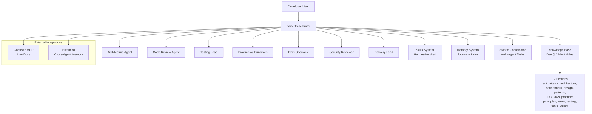
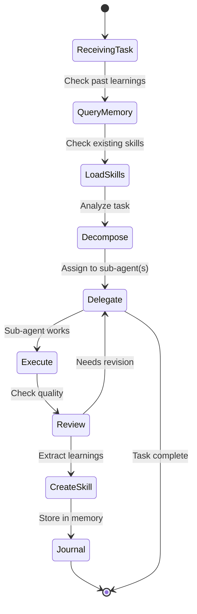
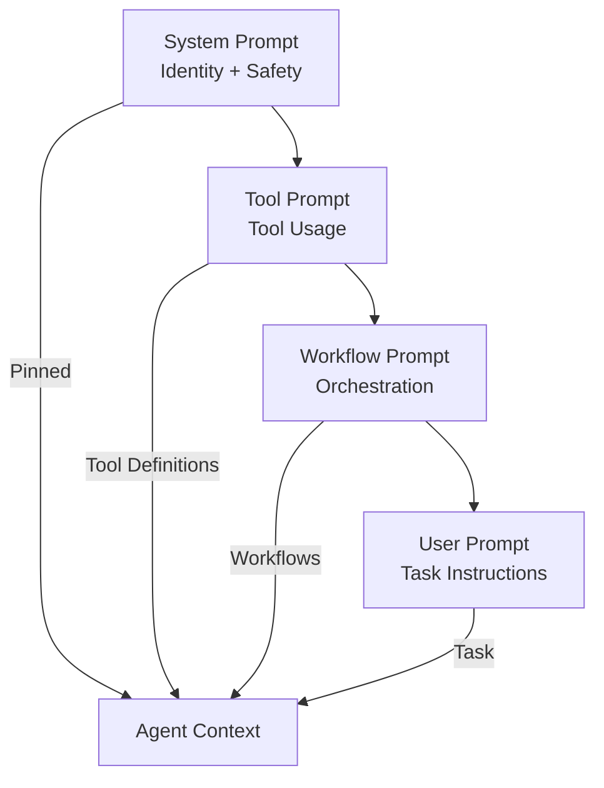
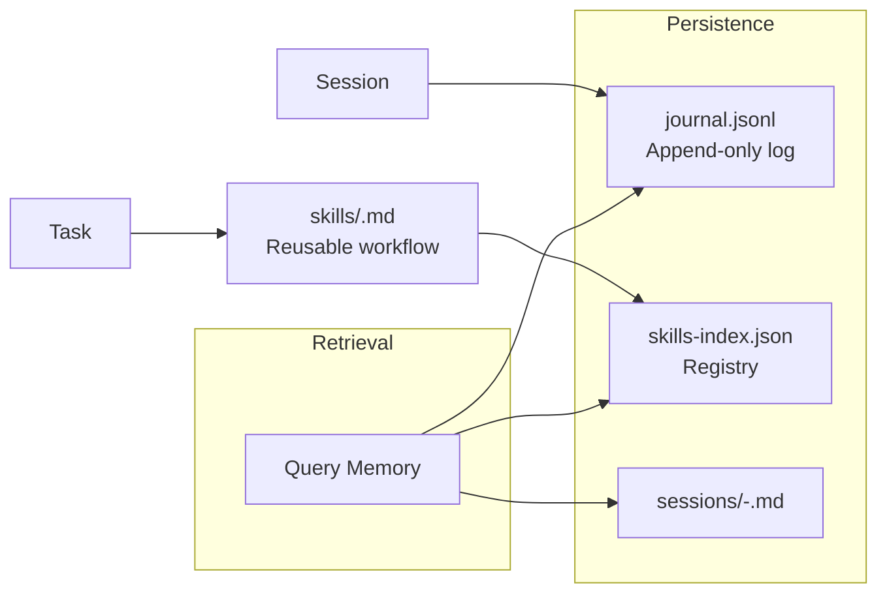
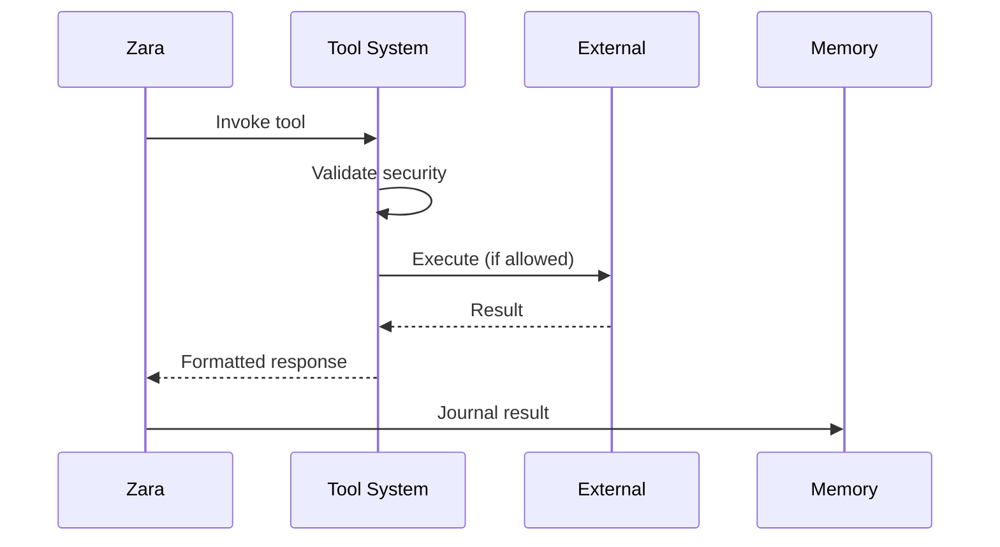
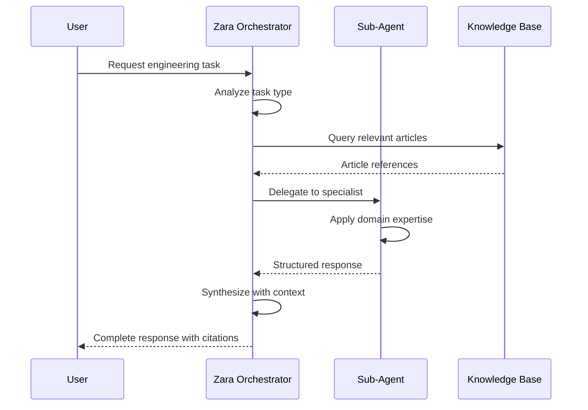
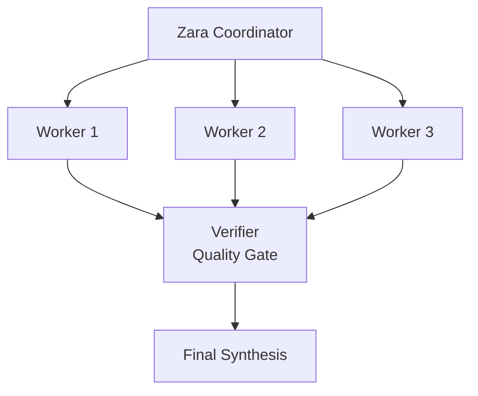
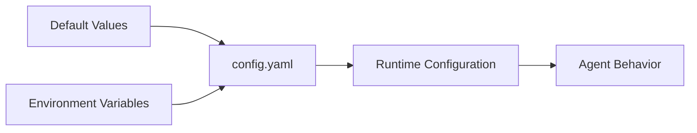

# Architecture

## Overview

Zara is your **senior engineering partner** — warm, direct, and committed to your growth. She coordinates 7 specialized sub-agents to solve complex engineering problems, grounded in the DevIQ knowledge base. Zara follows a hub-and-spoke architecture with herself as the central coordinator, always asking: does this need to exist? Does the stdlib do it? What's the minimum that works?

## Agent Lifecycle

## Prompt Architecture

Zara uses a layered prompt system:

### Prompt Layers

| Layer | Content | Purpose |
|-------|---------|---------|
| **System** | Agent identity, safety rules, core behavior | Immutable foundation |
| **Tool** | Tool definitions, usage instructions | Capability definition |
| **Workflow** | Task orchestration, delegation patterns | Process guidance |
| **User** | User-supplied instructions | Task context |

## Memory System

### Memory Components

| Component | Format | Purpose |
|-----------|--------|---------|
| Journal | JSONL | Append-only task log |
| Skills Index | JSON | Skill registry with usage |
| Sessions | Markdown | Per-session detailed logs |
| Skills | Markdown | Reusable workflow patterns |

## Tool Execution

## Sub-Agent System

Each sub-agent has:

1. **Specialized Prompt** — Domain-specific system prompt
2. **Knowledge Sources** — Relevant DevIQ sections
3. **Trigger Patterns** — When to engage this agent
4. **Output Format** — Structured response template

### Communication Flow

## Swarm Coordination

For complex tasks with 3+ workstreams:

## Configuration Flow

