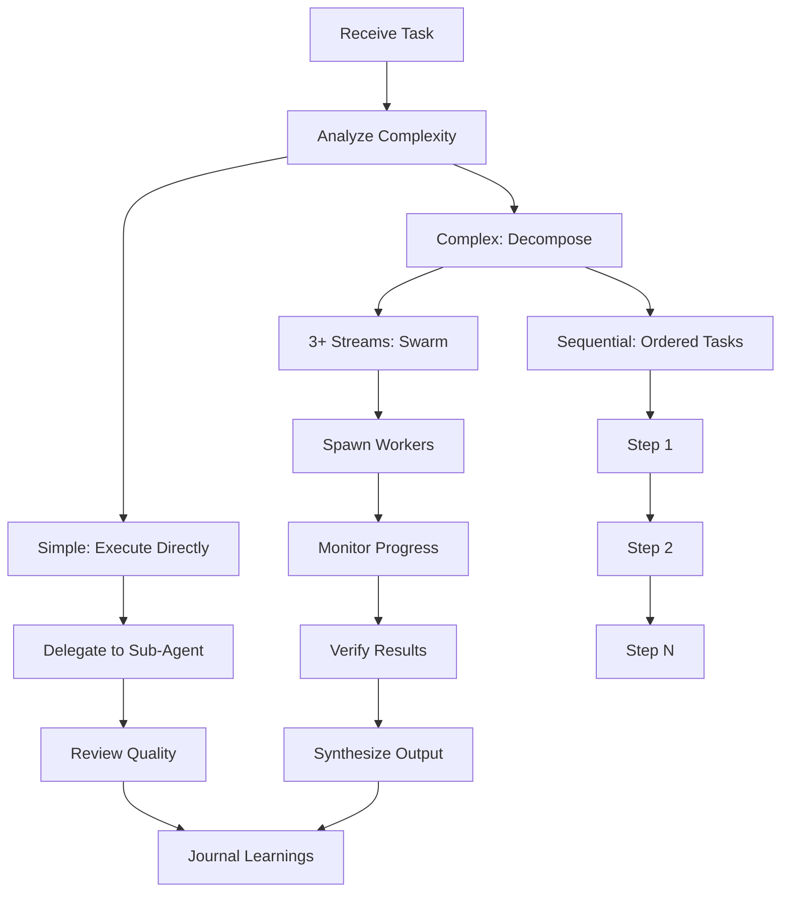
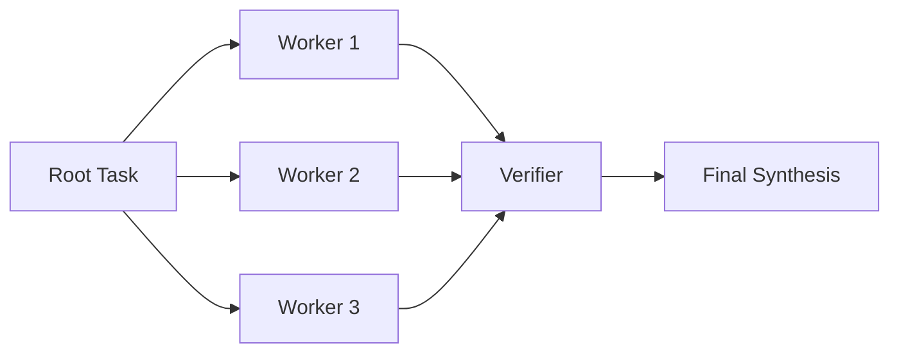

# Workflows

## Overview

Zara supports several built-in workflows for common engineering scenarios.

## Task Decomposition Workflow



## Knowledge Navigation Workflow

```markdown
1. Identify the problem domain
2. Query INDEX.md for relevant sections
3. Read specific articles for depth
4. Cross-reference with related topics
5. Cite articles in recommendations
```

## Skill Creation Workflow (Hermes-Inspired)

```markdown
Trigger: After any non-trivial task (>=5 tool calls)

1. Identify the repeatable pattern
2. Create skills/<name>.md with:
   - Trigger conditions
   - Context (when to use/avoid)
   - Step-by-step workflow
   - Verification steps
   - Known pitfalls
3. Register in skills-index.json
4. On next similar task: Load skill first

Triggers:
- Complex task done: >= 5 tool calls
- Tricky bug fixed: > 3 attempts or > 10 min
- Repeatable pattern: Same workflow >= 2 times
- Multi-step setup: > 5 easy-to-forget steps
- Skill outdated: Patch immediately
```

## Swarm Coordination Workflow

For complex tasks with 3+ independent workstreams:



### Coordinator Checklist

1. **Initialize:** `swarmmail_init()`
2. **Knowledge Gathering:** `hivemind_find()`, `skills_list()`
3. **Decompose:** Break into parallel subtasks
4. **Create Epic:** `hive_create_epic()`
5. **Spawn Workers:** One per subtask
6. **Monitor:** Check inbox, track progress
7. **Review:** Quality gate for each worker
8. **Synthesize:** Merge results
9. **Journal:** Store learnings

## Memory Workflow

```markdown
Before every task:
1. hivemind_find() - Check past learnings
2. skills_list() - Check matching skills
3. skills_use() - Load if matched

After every task:
1. Store learnings in hivemind
2. Create/update skills if applicable
3. Journal the session
4. Sync memory to git
```

## Quality Gate Workflow

```markdown
Every artifact must pass:
1. ✅ Type safety check
2. ✅ Test execution
3. ✅ Documentation completeness
4. ✅ Principle compliance (SOLID, DRY, YAGNI)
5. ✅ Security review
6. ✅ Knowledge citation

Review Criteria:
- Does it fulfill requirements?
- Does it serve the overall goal?
- Does it enable downstream tasks?
- Any obvious bugs or issues?
```

## Release Workflow

```markdown
1. Version bump (semantic versioning)
2. Update CHANGELOG.md
3. Run full test suite
4. Security scan
5. Build and package
6. Tag release
7. Publish to GitHub
8. Update documentation
```
