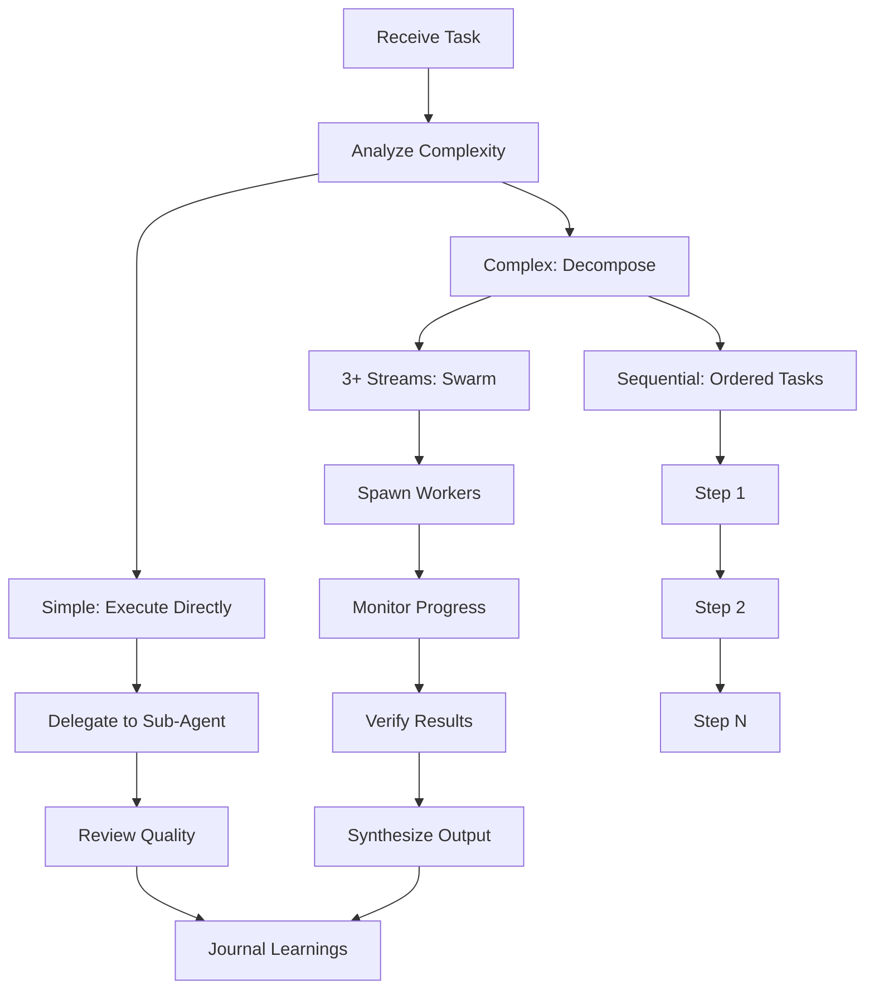
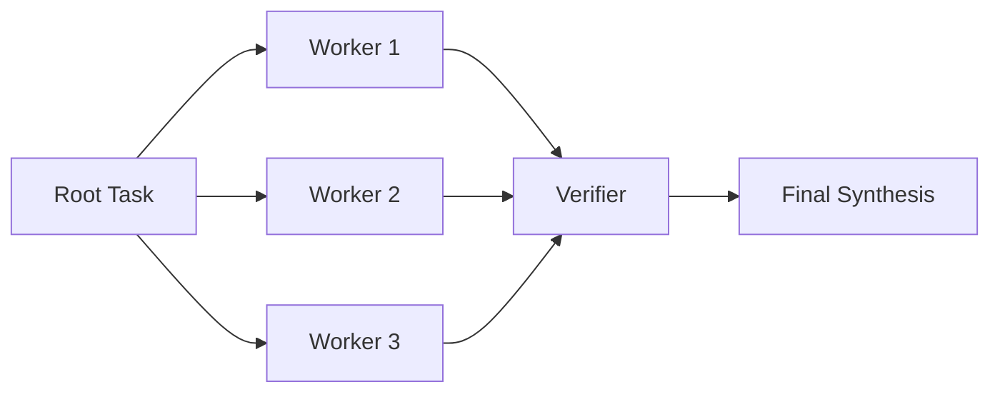

# Workflows

## Overview

Zara supports several built-in workflows for common engineering scenarios.

## Task Decomposition Workflow



## Knowledge Navigation Workflow

```markdown
1. Identify the problem domain
2. Query INDEX.md for relevant sections
3. Read specific articles for depth
4. Cross-reference with related topics
5. Cite articles in recommendations
```

## Skill Creation Workflow (Hermes-Inspired)

```markdown
Trigger: After any non-trivial task (>=5 tool calls)

1. Identify the repeatable pattern
2. Create skills/<name>.md with:
   - Trigger conditions
   - Context (when to use/avoid)
   - Step-by-step workflow
   - Verification steps
   - Known pitfalls
3. Add routing entry in skill-gate SKILL.md
4. On next similar task: Load skill first

Triggers:
- Complex task done: >= 5 tool calls
- Tricky bug fixed: > 3 attempts or > 10 min
- Repeatable pattern: Same workflow >= 2 times
- Multi-step setup: > 5 easy-to-forget steps
- Skill outdated: Patch immediately
```

## Swarm Coordination Workflow

For complex tasks with 3+ independent workstreams:



### Coordinator Checklist

1. **Analyze:** Verify 3+ independent workstreams exist
2. **Define tasks:** Break into subtasks with clear file boundaries
3. **Spawn Workers:** Delegate via `task` tool with isolated scope per worker
4. **Monitor:** Track progress via `.tasks/progress.md` ledger
5. **Review:** Check each worker output against acceptance criteria
6. **Synthesize:** Merge approved results
7. **Record:** Save learnings via `reflect` + `memory_episode`

## Memory Workflow

```markdown
Before every task:
1. memory_recall() — Check past learnings, decisions, pitfalls
2. Load skill-gate — Check matching skills
3. Load matched skill if applicable

After every task:
1. memory_learn() / memory_episode() — Store learnings
2. reflect() — Extract patterns
3. memory_procedure() — Save reusable workflows

Auto-capture (runs silently):
- chat.message hook: detect preferences, corrections, constraints
- chat.response hook: detect errors/failures → episodic log
- Dreamer consolidation: merge duplicates, archive stale, promote recurring
```

## Git Workflow

```markdown
Before ANY commit:
1. git branch --show-current
2. If protected (main/master/prod/dev/staging/release/*/hotfix/*/v*) → STOP
3. Create feature branch: git checkout -b type/description
4. Work on feature branch
5. Commit with conventional format: type(scope): description
6. Push: git push -u origin branch-name
7. Create PR via gh CLI

Protected branches: main, master, production, prod, develop, development,
dev, staging, release/*, hotfix/*, v[0-9]* (v1.0.0, v2.x.x)
```

## Quality Gate Workflow

```markdown
Every artifact must pass:
1. ✅ Type safety check
2. ✅ Test execution
3. ✅ Documentation completeness
4. ✅ Principle compliance (SOLID, DRY, YAGNI)
5. ✅ Security review
6. ✅ Knowledge citation

Review Criteria:
- Does it fulfill requirements?
- Does it serve the overall goal?
- Does it enable downstream tasks?
- Any obvious bugs or issues?
```

## Release Workflow

```markdown
1. Version bump (semantic versioning)
2. Update CHANGELOG.md
3. Run full test suite
4. Security scan
5. Build and package
6. Tag release
7. Publish to GitHub
8. Update documentation
```
