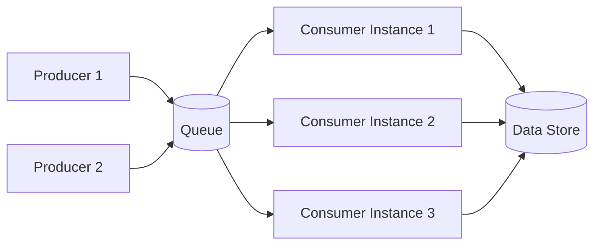

The Competing Consumers pattern is a distributed systems pattern in which producers place work items on a shared queue and multiple consumer instances compete to pull and process those messages. Because the queue delivers each message to exactly one consumer, multiple consumers can work in parallel without duplicating effort. The consumer that successfully claims a message owns it for the duration of processing.

This pattern is a practical solution for high-throughput workloads where a single processing instance cannot keep pace with the rate of incoming work.

## How It Works

In a typical flow:

1. One or more producers generate work items and publish them as messages to a shared queue.
2. The queue durably holds messages until a consumer is ready to process them.
3. Multiple consumer instances each attempt to pull the next available message.
4. The queue delivers each message to exactly one consumer (competing delivery).
5. The consumer processes the message and acknowledges completion, causing the queue to discard the message.
6. If processing fails, the queue makes the message available again (or routes it to a dead-letter queue after repeated failures).
7. Consumers persist results or trigger follow-on actions.

Each arrow from the queue to a consumer instance represents competing delivery: only one consumer receives any given message.

## Benefits

These are some of the benefits of the Competing Consumers pattern:

- **Scalability**: Adding more consumer instances increases throughput without changing producers or the queue.
- **Higher Throughput**: Multiple consumers process messages in parallel, reducing end-to-end latency under load.
- **Resilience**: If one consumer instance fails mid-processing, the queue redelivers the message to a healthy instance.
- **Load Leveling**: The queue absorbs bursts of incoming work and smooths demand so consumers process at a sustainable rate.
- **Independent Scaling**: Consumer capacity can be tuned independently of producers, allowing precise resource allocation for the processing tier.

## Tradeoffs

These are some of the tradeoffs to consider:

- **Message Ordering**: Because multiple consumers process messages concurrently, strict first-in-first-out ordering across all consumers is difficult to guarantee. Partitioned or session-based queues can restore ordering within a subset of messages when required.
- **Idempotency Requirements**: Queues may redeliver messages after a timeout or consumer crash. Consumer logic must be idempotent—processing the same message twice must produce the same outcome as processing it once.
- **Duplicate Processing Risk**: In at-least-once delivery systems, a message may be processed by more than one consumer instance in edge cases, such as when an acknowledgment is lost. Deduplication strategies (unique identifiers, idempotency keys) mitigate this.
- **Operational Complexity**: Teams must monitor queue depth, consumer lag, redelivery rates, and dead-letter queues. Poison messages—messages that consistently cause consumer failures—need explicit handling policies.
- **Visibility and Observability**: Tracing a single unit of work across producers, the queue, and whichever consumer instance handled it requires distributed tracing and correlated logging.

## Relationship to Other Patterns

The Competing Consumers pattern does not exist in isolation; it overlaps with several closely related patterns:

- **Web-Queue-Worker Architecture**: Web-Queue-Worker is an architectural style that positions competing consumers as the worker tier. The web frontend enqueues work, and a pool of worker instances—functioning as competing consumers—processes it asynchronously.
- **Event-Driven Architecture**: In event-driven systems, the messages on the queue are often domain events. Competing consumers provide one mechanism for distributing event processing load across multiple handler instances.
- **Producer-Consumer Pattern**: Competing Consumers is a multi-consumer specialization of the classic producer-consumer pattern. Where the classic pattern typically involves a single consumer, Competing Consumers scales that model horizontally so that many consumers share the same queue.

## When to Use

The Competing Consumers pattern is a strong fit when:

- Message volume exceeds what a single consumer instance can process within acceptable latency bounds.
- Workloads are bursty and benefit from a queue absorbing spikes before processing.
- Individual message processing is independent—each work item does not depend on the result of another in-flight item.
- Consumer instances can tolerate or be designed to handle redelivery safely.
- Processing throughput must scale without requiring changes to producer code or queue topology.

It may not be the right choice when strict global message ordering is a hard requirement, when processing items are tightly interdependent, or when exactly-once delivery guarantees are essential and the infrastructure cannot provide them natively.

## References

- [Competing Consumers Pattern (Microsoft Azure Architecture Center)](https://learn.microsoft.com/en-us/azure/architecture/patterns/competing-consumers)
