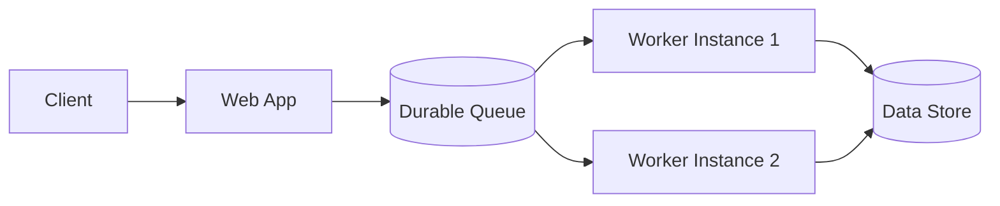

Web-Queue-Worker Architecture is a distributed systems pattern that separates user-facing web requests from longer-running background work. The web application receives requests and places work items on a durable queue. One or more worker processes consume items from the queue and execute the work asynchronously.

This pattern is commonly used when requests should return quickly, but the underlying work may take seconds or minutes to finish.

## How It Works

In a typical flow:

1. A client sends a request to the web application.
2. The web app validates input and stores a work item in a queue.
3. The web app returns quickly (often with an accepted or tracking response).
4. Worker services pull messages from the queue and execute the work.
5. Workers persist results, publish follow-up events, or notify users.

## Benefits

These are some of the benefits of Web-Queue-Worker Architecture:

- **Responsiveness**: The web tier can return quickly instead of blocking on long-running work.
- **Scalability**: Web and worker tiers can scale independently based on different load patterns.
- **Resilience**: Durable queues absorb spikes and provide buffering when downstream systems slow down.
- **Operational Flexibility**: You can tune concurrency, retries, and throughput in workers without changing user-facing endpoints.
- **Clear Separation of Concerns**: Request handling and background processing responsibilities stay distinct.

## Tradeoffs

These are some of the tradeoffs to consider:

- **Eventual Consistency**: Users may not see results immediately because processing is asynchronous.
- **Higher System Complexity**: You must manage queue infrastructure, worker lifecycle, and distributed observability.
- **Retry and Idempotency Requirements**: Workers may process messages more than once, so handlers should be idempotent.
- **Ordering and Concurrency Challenges**: Some workloads need strict ordering or deduplication strategies.
- **More Operational Surface Area**: Monitoring dead-letter queues, poison messages, and backlogs becomes essential.

## Starting Point for Distributed Systems

For teams getting started with distributed systems, Web-Queue-Worker is often an approachable first architecture pattern because it introduces key concepts incrementally:

- Independent scaling across components
- Asynchronous workflows
- Failure handling with retries and dead-letter queues
- Observability across process boundaries

A practical approach is to begin with a single web app, one durable queue, and one worker service. As load and requirements grow, teams can add more workers, partition queues, and introduce specialized processing pipelines.

## When to Use

Web-Queue-Worker is a strong fit when:

- Requests trigger expensive operations such as file processing, report generation, or external API orchestration.
- Throughput is bursty and workloads benefit from buffering.
- Users can tolerate asynchronous completion (for example, "Your request is being processed").

It may not be ideal when users require immediate, strongly consistent responses for every request.

## References

- [Web-Queue-Worker Architecture Review (NimblePros)](https://blog.nimblepros.com/blogs/web-queue-worker-architecture-review/)
- [Web-Queue-Worker style (Microsoft Azure Architecture Center)](https://learn.microsoft.com/en-us/azure/architecture/guide/architecture-styles/web-queue-worker)
