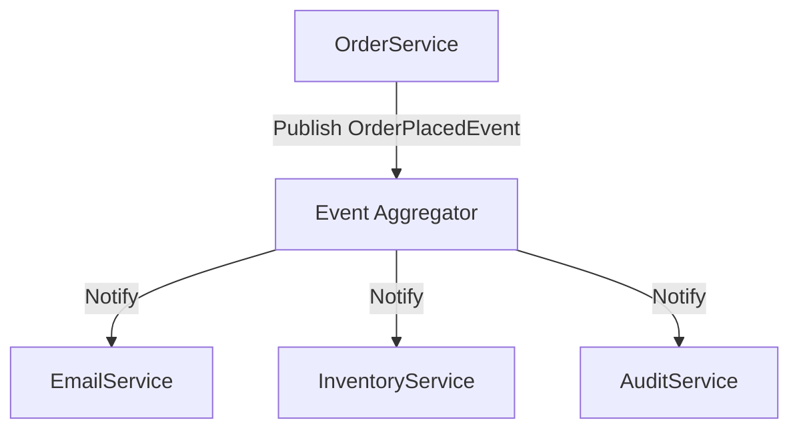

The Event Aggregator pattern provides a central hub that collects events from multiple sources and routes them to interested subscribers. Rather than having publishers hold direct references to their subscribers (as in the [Observer](/design-patterns/observer-pattern/) pattern), both sides depend only on the aggregator. This eliminates the need for publishers and subscribers to know anything about each other, resulting in a highly decoupled, extensible event-driven system.

## How It Works

The Event Aggregator has three key roles:

- **Publisher**: Raises events by submitting them to the aggregator. It has no knowledge of who, if anyone, is listening.
- **Event Aggregator**: The central broker that accepts published events and dispatches them to all registered subscribers for that event type.
- **Subscriber**: Registers interest in one or more event types and receives a callback when a matching event is published.

The aggregator is typically a singleton or a scoped service injected wherever publishing or subscribing is needed.

## An Example: eCommerce Order Notifications

Consider an eCommerce application where placing an order should trigger several independent reactions: sending a confirmation email, updating inventory, and logging an audit record. With the Event Aggregator, the `OrderService` simply publishes an `OrderPlacedEvent`; the other services subscribe to it independently.



The `OrderService` does not import, reference, or depend on `EmailService`, `InventoryService`, or `AuditService`. Each subscriber can be added, removed, or replaced without touching the publisher.

## C# Implementation

### Define the Event

Events are plain data objects. Using C# `record` types keeps them concise and immutable.

```csharp
public record OrderPlacedEvent(Guid OrderId, Guid CustomerId, decimal Total);
```

### The Event Aggregator Interface and Implementation

```csharp
public interface IEventAggregator
{
    void Subscribe<TEvent>(Action<TEvent> handler);
    void Unsubscribe<TEvent>(Action<TEvent> handler);
    void Publish<TEvent>(TEvent @event);
}

public class EventAggregator : IEventAggregator
{
    private readonly Dictionary<Type, List<Delegate>> _handlers = new();

    public void Subscribe<TEvent>(Action<TEvent> handler)
    {
        var type = typeof(TEvent);
        if (!_handlers.TryGetValue(type, out var list))
        {
            list = new List<Delegate>();
            _handlers[type] = list;
        }
        list.Add(handler);
    }

    public void Unsubscribe<TEvent>(Action<TEvent> handler)
    {
        if (_handlers.TryGetValue(typeof(TEvent), out var list))
        {
            list.Remove(handler);
        }
    }

    public void Publish<TEvent>(TEvent @event)
    {
        if (_handlers.TryGetValue(typeof(TEvent), out var list))
        {
            foreach (var handler in list.ToList())
            {
                ((Action<TEvent>)handler)(@event);
            }
        }
    }
}
```

### Publisher

```csharp
public class OrderService
{
    private readonly IEventAggregator _events;

    public OrderService(IEventAggregator events)
    {
        _events = events;
    }

    public void PlaceOrder(Guid customerId, decimal total)
    {
        var orderId = Guid.NewGuid();
        // ... persist the order ...

        _events.Publish(new OrderPlacedEvent(orderId, customerId, total));
    }
}
```

### Subscribers

```csharp
public class EmailService
{
    public EmailService(IEventAggregator events)
    {
        events.Subscribe<OrderPlacedEvent>(OnOrderPlaced);
    }

    private void OnOrderPlaced(OrderPlacedEvent e)
    {
        Console.WriteLine($"Sending confirmation email for order {e.OrderId}.");
    }
}

public class InventoryService
{
    public InventoryService(IEventAggregator events)
    {
        events.Subscribe<OrderPlacedEvent>(OnOrderPlaced);
    }

    private void OnOrderPlaced(OrderPlacedEvent e)
    {
        Console.WriteLine($"Reserving inventory for order {e.OrderId}.");
    }
}
```

### Wiring It Together

```csharp
var aggregator = new EventAggregator();

var emailService     = new EmailService(aggregator);
var inventoryService = new InventoryService(aggregator);

var orderService = new OrderService(aggregator);
orderService.PlaceOrder(Guid.NewGuid(), 99.99m);

// Output:
// Sending confirmation email for order <guid>.
// Reserving inventory for order <guid>.
```

## Use Cases

- **UI frameworks**: Coordinating state changes across loosely coupled view components (e.g., Prism's `IEventAggregator` in WPF/MAUI applications).
- **Modular monoliths**: Allowing independently developed modules to react to each other's events without compile-time coupling.
- **Domain event dispatching**: Collecting [domain events](/design-patterns/domain-events-pattern/) raised by aggregates and delivering them to handlers after persistence.
- **Cross-cutting notifications**: Propagating events such as user login, configuration changes, or background job completion to multiple unrelated listeners.

## Benefits

### Complete Decoupling

Publishers and subscribers share no direct dependency. This makes it straightforward to add new reactions to an event without modifying the publisher or any existing subscriber.

### Single Dependency for All Events

Components need only a reference to the aggregator rather than maintaining a growing list of direct dependencies on every service they wish to notify.

### Runtime Flexibility

Subscribers can be registered and unregistered at runtime, enabling dynamic feature toggling, plugin architectures, and conditional behavior.

### Testability

The aggregator can be replaced with a test double, or events can be published directly in tests to exercise subscriber logic in isolation.

## Drawbacks

### Memory Leaks

If subscribers are not explicitly unsubscribed before being garbage collected, the aggregator retains references to them indefinitely. Using weak references or ensuring proper cleanup (e.g., implementing `IDisposable`) mitigates this risk.

### Invisible Control Flow

Because publishers and subscribers are not directly linked, it can be difficult to trace which handlers respond to a given event without searching the codebase. Good naming conventions and tooling help, but the indirection is inherent.

### Ordering and Error Handling

The order in which handlers are invoked is typically registration order, which may be non-obvious. An exception thrown by one handler can prevent subsequent handlers from executing unless the aggregator explicitly catches and handles errors.

### Potential for Overuse

Not every interaction benefits from indirection. Using the Event Aggregator for simple, direct method calls adds unnecessary complexity without meaningful decoupling.

## Event Aggregator vs. Related Patterns

| Pattern | Key Distinction |
|---|---|
| [Observer](/design-patterns/observer-pattern/) | Subject holds direct references to observers; publisher and subscriber are in the same process context and often the same codebase layer. |
| [Mediator](/design-patterns/mediator-pattern/) | Coordinates interactions between specific, known components; typically orchestrates workflows rather than broadcasting events to unknown subscribers. |
| [Domain Events](/design-patterns/domain-events-pattern/) | Focuses on events that represent meaningful state changes within the domain model; often *delivered* via an Event Aggregator or Mediator. |

## References

- [Martin Fowler - Event Aggregator](https://martinfowler.com/eaaDev/EventAggregator.html)
- [Patterns of Enterprise Application Architecture](https://amzn.to/3ELqAYn) — Martin Fowler
- [Prism IEventAggregator (WPF / MAUI)](https://prismlibrary.com/docs/event-aggregator.html)
